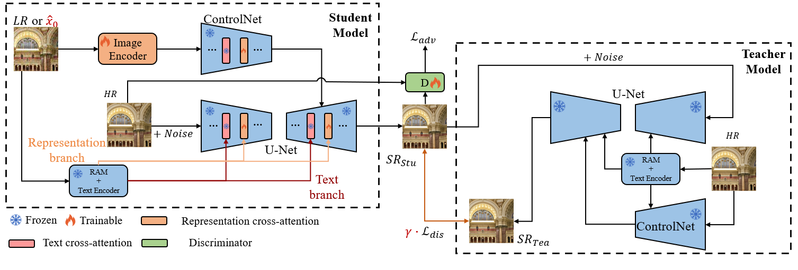
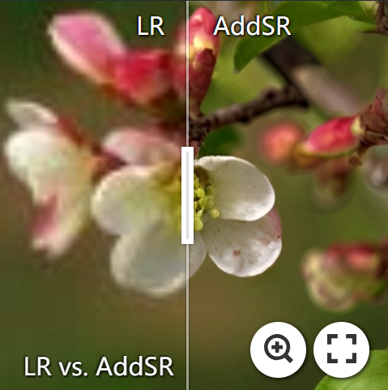
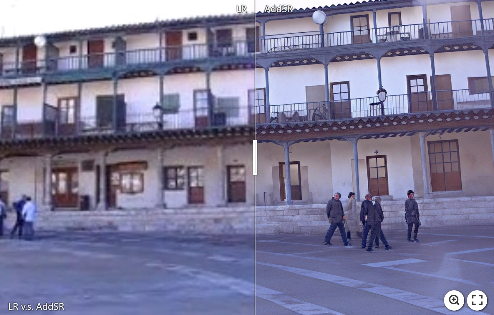
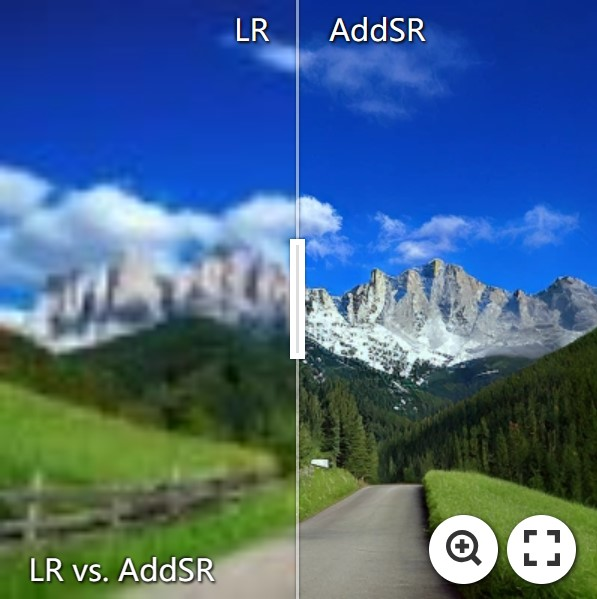
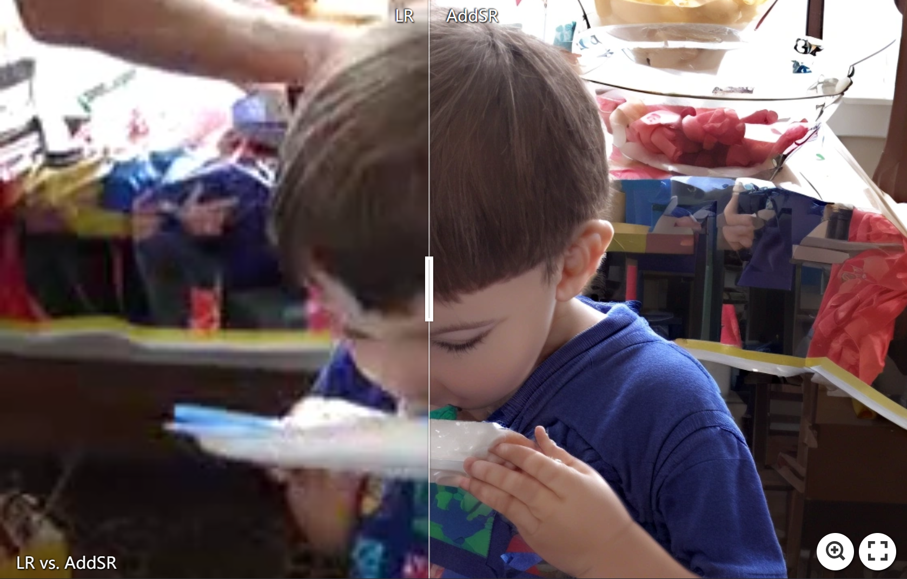
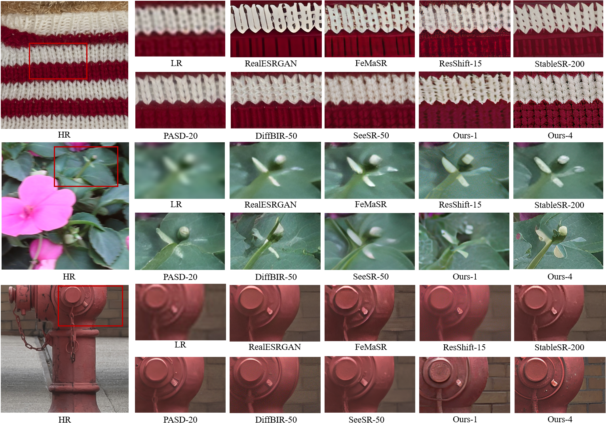

## AddSR: Accelerating Diffusion-based Blind Super-Resolution with Adversarial Diffusion Distillation

<a href='https://arxiv.org/abs/2404.01717'></a> &nbsp;&nbsp; [](https://nju-pcalab.github.io/projects/AddSR/) &nbsp;&nbsp; 

[Rui Xie](https://github.com/CSRuiXie)<sup>1</sup> | [Ying Tai](https://tyshiwo.github.io/index.html)<sup>2</sup> | [Kai Zhang](https://cszn.github.io/)<sup>2</sup> | [Zhenyu Zhang](https://jessezhang92.github.io/)<sup>2</sup> | [Jun Zhou](https://scholar.google.com/citations?hl=zh-CN&user=w03CHFwAAAAJ)<sup>1</sup> | [Jian Yang](https://scholar.google.com.hk/citations?user=6CIDtZQAAAAJ&hl=zh-CN)<sup>3</sup>

<sup>1</sup>Southwest University, <sup>2</sup>Nanjing University, <sup>3</sup>Nanjing University of Science and Technology. 

:star: If AddSR helps your images or projects, please consider giving this repo a star. Your support is greatly appreciated!

### 🔆 Updates
- **2024.04.10**  The training code has been released. Please note that it currently only supports a batch size of 2 per device. We will make it possible to support different batchsizes in the future.
- **2024.04.09**  The pretrained AddSR model and testing code have been released.


### 📌 TODO
- ✅ Release the pretrained model
- ✅ Release the training code

## 🔎 Method Overview


## 📷 Results Display
[](https://imgsli.com/MjUyNTc5) [](https://imgsli.com/MjUyNTkx) 
[](https://imgsli.com/MjUyNTgx) [](https://imgsli.com/MjUyNTky)




## ⚙️ Dependencies and Installation
```
## git clone this repository
git clone https://github.com/NJU-PCALab/AddSR.git
cd AddSR

# create an environment with python >= 3.8
conda create -n addsr python=3.8
conda activate addsr
pip install -r requirements.txt
```

## 🚀 Inference
#### Step 1: Download the pretrained models
- Download the pretrained SD-2-base models from [HuggingFace](https://huggingface.co/stabilityai/stable-diffusion-2-base).
- Download the AddSR models from [GoogleDrive](https://drive.google.com/file/d/19dMAc4mzFSSfU23y5g44v3nZS-edubGw/view?usp=sharing)
- Download the DAPE models from [GoogleDrive](https://drive.google.com/drive/folders/12HXrRGEXUAnmHRaf0bIn-S8XSK4Ku0JO?usp=drive_link)

You can put the models into `preset/`.

#### Step 2: Prepare testing data
You can put the testing images in the `preset/datasets/test_datasets`.

#### Step 3: Running testing command
```
python test_addsr.py \
--pretrained_model_path preset/models/stable-diffusion-2-base \
--prompt '' \
--addsr_model_path preset/models/addsr \
--ram_ft_path preset/models/DAPE.pth \
--image_path preset/datasets/test_datasets \
--output_dir preset/datasets/output \
--start_point lr \
--num_inference_steps 4 \
--PSR_weight 0.5
```


#### Test Benchmark
`RealLR200`, `RealSR` and `DRealSR` can be downloaded from [SeeSR](https://drive.google.com/drive/folders/1L2VsQYQRKhWJxe6yWZU9FgBWSgBCk6mz?usp=drive_link).

## 🌈 Train 

#### Step1: Download the pretrained models
Download the pretrained [SD-2-base models](https://huggingface.co/stabilityai/stable-diffusion-2-base), [RAM](https://huggingface.co/spaces/xinyu1205/recognize-anything/blob/main/ram_swin_large_14m.pth), [SeeSR](https://drive.google.com/drive/folders/12HXrRGEXUAnmHRaf0bIn-S8XSK4Ku0JO?usp=drive_link) and [DINOv2](https://dl.fbaipublicfiles.com/dinov2/dinov2_vits14/dinov2_vits14_pretrain.pth). You can put them into `preset/models`.

#### Step2: Prepare training data
We employ the same preprocessing measures as SeeSR. More details can be found at [HERE](https://github.com/cswry/SeeSR?tab=readme-ov-file#step2-prepare-training-data)

#### Step3: Training for AddSR
```
 CUDA_VISIBLE_DEVICES="0, 1, 2, 3" accelerate launch train_addsr.py \
--pretrained_model_name_or_path="preset/models/stable-diffusion-2-base" \
--controlnet_model_name_or_path_Tea='preset/seesr' \
--unet_model_name_or_path_Tea='preset/seesr' \
--controlnet_model_name_or_path_Stu='preset/seesr' \
--unet_model_name_or_path_Stu='preset/seesr' \
--dino_path = "preset/models/dinov2_vits14_pretrain.pth" \
--output_dir="./experience/addsr" \
--root_folders 'DataSet/training' \
--ram_ft_path 'preset/models/DAPE.pth' \
--enable_xformers_memory_efficient_attention \
--mixed_precision="fp16" \
--resolution=512 \
--learning_rate=2e-5 \
--train_batch_size=2 \
--gradient_accumulation_steps=2 \
--null_text_ratio=0.5 \
--dataloader_num_workers=0 \
--max_train_steps=50000 \
--checkpointing_steps=5000
```
- `--pretrained_model_name_or_path` the path of pretrained SD model from Step 1
- `--root_folders` the path of your training datasets from Step 2
- `--ram_ft_path` the path of your DAPE model from Step 3


## ❤️ Acknowledgments
This project is based on [SeeSR](https://github.com/cswry/SeeSR), [diffusers](https://github.com/huggingface/diffusers), [BasicSR](https://github.com/XPixelGroup/BasicSR), [ADD](https://arxiv.org/abs/2311.17042) and [StyleGAN-T](https://github.com/autonomousvision/stylegan-t). Thanks for their awesome works.

## 📧 Contact
If you have any inquiries, please don't hesitate to reach out via email at `ruixie0097@gmail.com`

## 🎓Citations
If our project helps your research or work, please consider citing our paper:

```
@misc{xie2024addsr,
      title={AddSR: Accelerating Diffusion-based Blind Super-Resolution with Adversarial Diffusion Distillation}, 
      author={Rui Xie and Ying Tai and Kai Zhang and Zhenyu Zhang and Jun Zhou and Jian Yang},
      year={2024},
      eprint={2404.01717},
      archivePrefix={arXiv},
      primaryClass={cs.CV}
}
```
